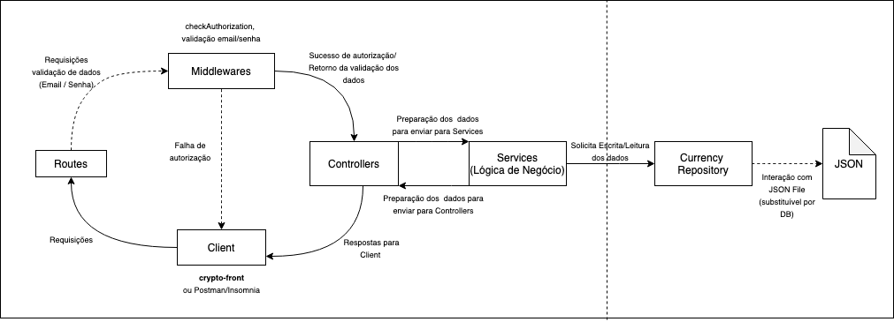

# crypto-api

API para visualização do preço do BitCoin para diferentes moedas: `USD`, `BRL`, `EUR` e `CAD` (Dólar Americano, Real, Euro e Dólar Canadense). O frontend da api se encontra em outro repositório: [crypto-front](https://github.com/bpoliana/crypto-front)
## Tech-stack

Foi escolhida a linguagem _TypeScript_, por causa da atual familiaridade da autora com tecnologia e o framework _Express_ em função da sua flexibilidade. Para a requisição feita à API Coin Desk, foi utilizado o `axios`. Para os testes, foi escolhido o `jest`. 
## Dependências
Para rodar esse projeto localmente, é necessário ter `node.js` instalado. Preferencialmente, a partir da versão `14.x.x` visto a compatibilidade das dependências do projeto. 
Recomenda-se o uso do módulo `nvm` para gerenciar a versão do node logal. 


## Como rodar 
Para instalar as dependências:
```
npm install
```
Para subir a aplicação localmente: 
```
npm start
```

## Testando 
Para rodar os Testes Unitários use o comando: 
```
npm test
```
## Linter e Husky
Na tentativa de manter padrões sensatos durante a implementação, utlizei o `eslint` como linter para padronização do estilos dos arquivos de texto. E para verificar se o código inserido não quebrava os testes presentes na aplicação, adicionei `husky` com um script que rodava o lint-staged e os testes da aplicação antes de cada commit. 


## A Arquitetura
A Arquitetura desse projeto pode ser entendida como uma abstração do desenho a seguir:




### Decisões de projeto

A estrutura do projeto foi pensada para ser simples e versátil, na intenção que pudesse ser uma aplicação escalável. A arquitetura ficou separada da interação com o arquivo JSON, o que permite a implantação de um banco de dados no futuro, sem alterar a arquitetura. 
As decisões de tecnologias a serem utilizadas _TypeScript_ e _Express_ baseou-se nas que são mais utlizadas no dia a dia da autora, nos últimos meses.

### TO DO List 

- Aumentar a cobertura de testes com foco nos casos de uso dos serviços 
- Testes unitários para os controllers
- Alterar tratamento de validações de requisição para ficar totalmente centralizado nas middlewares

Possíveis melhorias: 
- Alterar a aplicação para o padrão REST
- Adicionar cache para chamada da API Coin Desk
- Subir a aplicação em um Docker 
